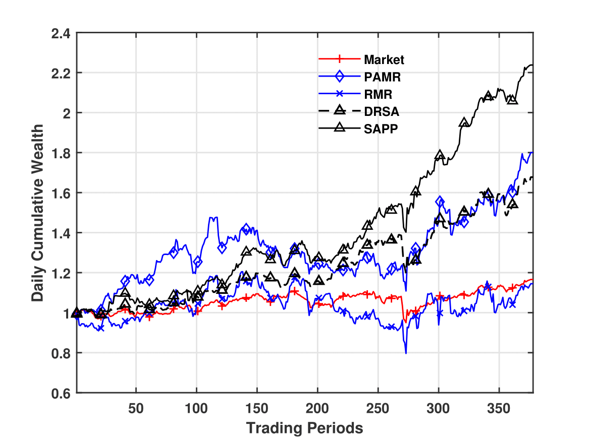

# SAPP: Sparse Attention Transformers for Pattern Recognition in Portfolio Management

 

&nbsp;

## About SAPP

**SAPP (Sparse Attention Portfolio Policy)** is a novel and efficient pattern recognition framework for portfolio management (PM). Traditional Transformer models, despite their power, suffer from quadratic computational complexity, making them impractical for real-time portfolio rebalancing with long financial time series. SAPP addresses this critical challenge by introducing a dual-stage architecture with **near-linear complexity**.

Our framework integrates:
1.  **Stacked Sparse Transformer Blocks (STBs)**: To efficiently capture long-range temporal dependencies in financial data.
2.  **A Correlation Information Decision Module (CIDM)**: To explicitly model cross-asset correlations for informed investment decisions.

Trained within a deep reinforcement learning framework, SAPP learns robust policies that consistently outperform a wide range of classic and state-of-the-art strategies, including its full-attention counterpart, demonstrating superior performance, efficiency, and scalability.

## Key Features

* **🚀 Near-Linear Complexity**: Employs a novel sparse attention mechanism combining local, global, and random patterns, making it highly scalable for long sequences and high-frequency data.
* **🧠 Intelligent Cross-Asset Analysis**: The CIDM module effectively models the interrelationships between assets, leading to more sophisticated and robust portfolio allocation decisions.
* **📈 State-of-the-Art Performance**: Empirically validated across four major stock market indices (NYSE 100, DJCA, EURO 50, CSI 300), SAPP demonstrates superior returns and risk-adjusted performance.
* **🔬 Interpretable & Robust**: Provides a degree of interpretability through feature attribution and causal analysis, and shows strong robustness to hyper-parameter variations and input perturbations.

## Architecture Overview

The SAPP architecture consists of two main components: stacked STBs for efficient temporal feature extraction, and a CIDM for making final portfolio decisions based on asset interrelationships.

 
  
 <em>Figure 1: The overall architecture of SAPP, where stacked STBs are used to efficiently extract representations from financial time series data by employing the sparse self-attention mechanism, and the CIDM is responsible for considering interrelationships among assets and making PM decisions.</em>

## Performance Highlights

SAPP (black line) consistently achieves the highest cumulative wealth across all tested datasets, significantly outperforming benchmark strategies and other Transformer-based models.

<table >
  <tr>
    <td align="center" style="border:none;">
      
       (a) NYSE 100
    </td>
    <td align="center" style="border:none;">
      
       (b) DJCA
    </td>
  </tr>
  <tr>
    <td align="center" style="border:none;">
      
       (c) EURO 50
    </td>
    <td align="center" style="border:none;">
      
       (d) CSI 300
    </td>
  </tr>
</table>

<em>Figure 2: Out-of-sample daily cumulative wealth achieved by the main strategies on the four datasets.</em>

## Baseline Implementations

In our paper, we benchmarked SAPP against a comprehensive set of baseline methods, including classic, state-of-the-art, and Transformer-based models. As per the Journal's request, we provide access to the baseline code as follows:

### Reproduced Baselines

For the following two Transformer-based models, we have included our own implementation within this repository to ensure a fair and consistent comparison. You can find their code in the `finol/model_layer` directory.

<strong>List of the Transformer-based baselines we implemented</strong>

* **Sparse Transformer**: Child et al. 2019, _arXiv_ [[code](https://github.com/jiahaoli57/SAPP/tree/main/finol/model_layer/SparseTransformer.py)] [[paper](https://arxiv.org/abs/1904.10509)]
* **DRSA**: Wang et al. 2025, _Pattern Recognition_ [[code](https://github.com/jiahaoli57/SAPP/tree/main/finol/model_layer/DRSA.py)] [[paper](https://www.sciencedirect.com/science/article/pii/S0031320324008094)]

### Referenced Baselines

For most of the classic and state-of-the-art online portfolio selection strategies, we refer to existing implementations in well-established open-source libraries.

A majority of the following algorithms from our study can be found in the excellent `olps` Matlab library:

> **GitHub - OLPS**: [https://github.com/OLPS/OLPS](https://github.com/OLPS/OLPS)

<strong>List of the specific baselines we compared against</strong>

* **Benchmark Baselines**:
  * **UCRP**: Kelly 1956, _The Bell System Technical Journal_ [[code](https://github.com/OLPS/OLPS/blob/master/Strategy/ucrp_run.m)] [[paper](https://ieeexplore.ieee.org/abstract/document/6771227/)]
  * **BCRP**: Cover 1991, _Mathematical Finance_ [[code](https://github.com/OLPS/OLPS/blob/master/Strategy/bcrp_run.m)] [[paper](https://onlinelibrary.wiley.com/doi/abs/10.1111/j.1467-9965.1991.tb00002.x)]
* **Classic Baselines**:
  * **UP**: Cover 1991, _Mathematical Finance_ [[code](https://github.com/OLPS/OLPS/blob/master/Strategy/up_run.m)] [[paper](https://onlinelibrary.wiley.com/doi/abs/10.1111/j.1467-9965.1991.tb00002.x)]
  * **EG**: Helmbold et al. 1998, _Mathematical Finance_ [[code](https://github.com/OLPS/OLPS/blob/master/Strategy/eg_run.m)] [[paper](https://onlinelibrary.wiley.com/doi/abs/10.1111/1467-9965.00058)]
  * **ONS**: Agarwal et al. 2006,	_International Conference on Machine Learning_ [[code](https://github.com/OLPS/OLPS/blob/master/Strategy/ons_run.m)] [[paper](https://dl.acm.org/doi/abs/10.1145/1143844.1143846)]
* **State-of-the-art Baselines**:
  * **ANTI1**: Borodin et al. 2004, _Advances in Neural Information Processing Systems_ [[code](https://github.com/OLPS/OLPS/blob/master/Strategy/anticor_run.m)] [[paper](https://proceedings.neurips.cc/paper_files/paper/2003/hash/8c9f32e03aeb2e3000825c8c875c4edd-Abstract.html)]
  * **ANTI2**: Borodin et al. 2004, _Advances in Neural Information Processing Systems_ [[code](https://github.com/OLPS/OLPS/blob/master/Strategy/anticor_anticor_run.m)] [[paper](https://proceedings.neurips.cc/paper_files/paper/2003/hash/8c9f32e03aeb2e3000825c8c875c4edd-Abstract.html)] 
  * **PAMR**: Li et al. 2012,	_Machine Learning_ [[code](https://github.com/OLPS/OLPS/blob/master/Strategy/pamr_run.m)] [[paper](https://link.springer.com/article/10.1007/s10994-012-5281-z)]
  * **CWMR-Var**: Li et al. 2013,	_ACM Transactions on Knowledge Discovery from Data_ [[code](https://github.com/OLPS/OLPS/blob/master/Strategy/cwmr_var_run.m)] [[paper](https://link.springer.com/article/10.1007/s10994-012-5281-z)]
  * **CWMR-Stdev**: Li et al. 2013,	_ACM Transactions on Knowledge Discovery from Data_ [[code](https://github.com/OLPS/OLPS/blob/master/Strategy/cwmr_stdev_run.m)] [[paper](https://link.springer.com/article/10.1007/s10994-012-5281-z)]
  * **OLMAR-S**: Li et al. 2015,	_Artificial Intelligence_ [[code](https://github.com/OLPS/OLPS/blob/master/Strategy/olmar1_run.m)] [[paper](https://www.sciencedirect.com/science/article/pii/S0004370215000168)]
  * **OLMAR-E**: Li et al. 2015,	_Artificial Intelligence_ [[code](https://github.com/OLPS/OLPS/blob/master/Strategy/olmar2_run.m)] [[paper](https://www.sciencedirect.com/science/article/pii/S0004370215000168)]
  * **RMR**: Huang et al. 2016,	_IEEE Transactions on Knowledge and Data Engineering_ [[code](https://github.com/OLPS/OLPS/blob/master/Strategy/rmr_run.m)] [[paper](https://ieeexplore.ieee.org/abstract/document/7465840)]

### Official Implementations for Specific SOTA Baselines
For some of the more recent state-of-the-art baselines not included in the general `olps` toolkit, we link directly to the official code provided by the authors:

<strong>List of the specific baselines we compared against</strong>

* **SPOLC**: Lai et al. 2020, _Journal of Machine Learning Research_ [[code](https://github.com/laizhr/SPOLC/blob/master/SPOLC_run.m)] [[paper](https://www.jmlr.org/papers/v21/19-959.html)]
* **RPRT**: Lai et al. 2020, _IEEE Transactions on Systems, Man, and Cybernetics: Systems_ [[code](https://github.com/laizhr/RPRT/blob/master/RPRT_run.m)] [[paper](https://ieeexplore.ieee.org/abstract/document/8411138)]

## License

Released under the [MIT License](https://github.com/jiahaoli57/sapp/blob/main/LICENSE).

## Contact Us

For further discussions, please get in touch with the repo manager (Jiahao Li) via lijh@pbcsf.tsinghua.edu.cn.
